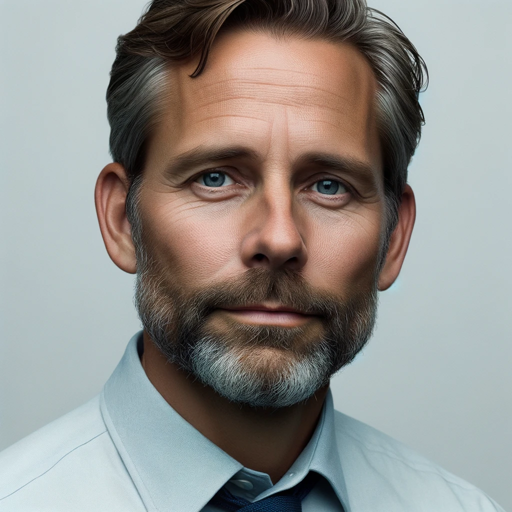

# Chief Technology Officer (CTO)/IT Director

## Demographics

- **Name:** Alex Jensen
- **Age:** 42
- **Background:** 
  - Master's degree in Information Technology from the University of Manchester
  - MBA from London Business School
  - 15+ years of experience in healthcare technology management

## Goals and Challenges
- **Goals:** 
  1. Ensure all technology systems in the hospital run without disruptions.
  2. Achieve seamless integration of new technology with existing hospital systems.
- **Challenges:** 
  1. Maintaining a balance between technological advancements and budget constraints.
  2. Ensuring utmost data security while keeping up with the latest technology trends.

## Values
- Prioritizes technological efficiency.
- Upholds the highest standards of data security.
- Focuses on achieving a positive return on investment for all technology acquisitions.

## Role in Purchase
- Oversees the technical aspects of the procurement process.
- Collaborates with vendors to ensure software and hardware compatibility.
- Makes the final decision on major IT purchases after consulting with the IT team.

## Engagement Strategy
- Prefer demonstrations and proof-of-concept over sales pitches.
- Values testimonials and case studies from similar hospitals or healthcare institutions.
- Open to attending webinars and technology conferences to stay updated.

## Product Solutions
- How our product solves their challenges:
  1. **Seamless Integration**: Our software is designed to integrate effortlessly with existing hospital systems, ensuring a smooth transition.
  2. **Data Protection**: Advanced encryption and multi-factor authentication guarantee the security of patient data.
  3. **Dedicated Tech Support**: Our team provides 24/7 technical support, ensuring any issues are addressed promptly.
  4. **Regular Updates**: We offer regular software updates, keeping the hospital systems up-to-date with the latest technological advancements.
  5. **Operational Efficiency**: With features like automated workflows and data analytics, our product enhances the overall efficiency of the hospital.

---
> Quick Quote: "In the heart of healthcare, technology makes all the difference."